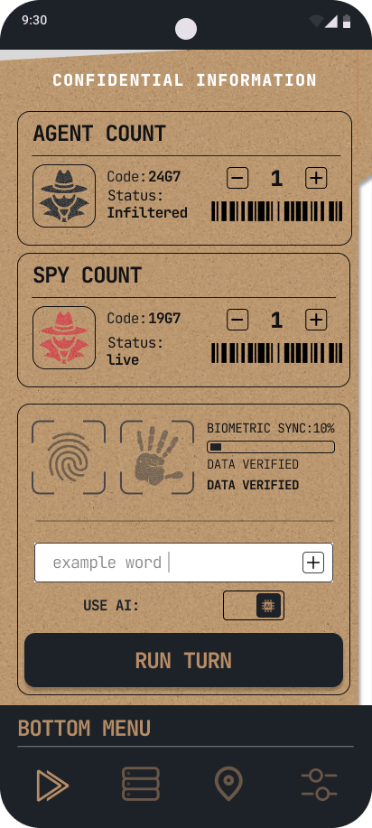

🕵️ Spy Manager

🎮 بازی گروهی جاسوسی و معمایی برای دورهمی‌ها

یک بازی گروهی سرگرم‌کننده که بازیکنان در آن نقش‌های مختلفی دریافت می‌کنند و با استفاده از سرنخ، گفتگو و دقت تلاش می‌کنند جاسوس را شناسایی کنند.

 "Status" (https://img.shields.io/badge/Status-In%20Development-orange?style=for-the-badge)
"Platform" (https://img.shields.io/badge/Platform-Android-green?style=for-the-badge)
"Kotlin" (https://img.shields.io/badge/Kotlin-2.x-purple?style=for-the-badge&logo=kotlin)

---

📱 Screenshots

  
  &nbsp;&nbsp;&nbsp;&nbsp;
  

  تصاویر مربوط به نسخه فعلی پروژه هستند.

---

🎯 درباره پروژه

Spy Manager یک بازی گروهی برای Android است که با هدف ایجاد یک تجربه ساده، سریع و سرگرم‌کننده برای دورهمی‌ها توسعه داده می‌شود.

این پروژه علاوه بر جنبه محصولی، یک پروژه عملی برای پیاده‌سازی اصول مدرن توسعه Android است. در حال حاضر ساختار داخلی پروژه در حال بازطراحی و انتقال تدریجی به Clean Architecture است.

تمرکز اصلی توسعه روی موارد زیر است:

- معماری قابل توسعه و مقیاس‌پذیر
- کد تمیز و قابل نگهداری
- تجربه کاربری مناسب
- عملکرد و Startup سریع
- تست‌پذیری
- جداسازی صحیح مسئولیت‌ها

---

✨ Features

- 🕵️ سیستم نقش و جاسوس
- 👥 مناسب برای بازی‌های گروهی
- 🎭 مدیریت نقش بازیکنان
- 🎯 مکانیزم شناسایی جاسوس
- 🎨 رابط کاربری مدرن و فارسی
- 🌙 طراحی مبتنی بر Material 3
- ⚡ تمرکز روی Performance و Startup
- 🧩 معماری قابل توسعه

---

🛠️ Tech Stack

📱 Android Development

Technology| کاربرد
Kotlin| زبان اصلی توسعه
Android SDK| پلتفرم توسعه
Jetpack Compose| ساخت رابط کاربری
Material 3| طراحی و کامپوننت‌های UI
Navigation Compose| مدیریت Navigation
Coroutines| پردازش‌های Asynchronous
Flow| مدیریت جریان داده

🏗️ Architecture & Design

Technology / Pattern| کاربرد
Clean Architecture| جداسازی لایه‌های برنامه
MVVM / MVI| مدیریت State و منطق UI
Repository Pattern| مدیریت دسترسی به داده
Use Case| جداسازی منطق کسب‌وکار
Dependency Injection| مدیریت وابستگی‌ها
Hilt| پیاده‌سازی Dependency Injection

💾 Data & Networking

Technology| کاربرد
Room| ذخیره‌سازی داده‌های محلی
Retrofit| ارتباط با REST API
OkHttp| مدیریت HTTP Requests
Kotlin Serialization| Serialization / Deserialization

🧰 Development Tools

- Android Studio
- Gradle
- KSP
- Git
- GitHub
- GitHub Actions

---

🏛️ Architecture

پروژه در حال مهاجرت به Clean Architecture است.

ساختار هدف پروژه:

app/
│
├── data/
│   ├── local/
│   ├── remote/
│   ├── repository/
│   └── mapper/
│
├── domain/
│   ├── model/
│   ├── repository/
│   └── usecase/
│
└── presentation/
    ├── screen/
    ├── component/
    ├── navigation/
    └── state/

Presentation

مسئول رابط کاربری، مدیریت State و تعامل کاربر با برنامه.

Domain

شامل منطق اصلی برنامه، مدل‌های Domain، قرارداد Repository و Use Caseها.

Data

مسئول دریافت، ذخیره و تبدیل داده‌ها از منابع مختلف مانند Local Database و API.

---

⚡ Performance

یکی از اهداف پروژه، کاهش زمان Startup و بهبود عملکرد اولیه برنامه است.

Startup Benchmark

Configuration| Average Startup
❌ Without Baseline Profile| 1,231 ms
🚧 With Baseline Profile| در حال اندازه‌گیری

«Benchmarkها در شرایط یکسان اندازه‌گیری می‌شوند و نتایج نهایی پس از تکمیل بهینه‌سازی ثبت خواهند شد.»

---

🚧 Development Status

بخش| وضعیت
🎨 UI / UX| 🟢 در حال توسعه
🎮 Game Logic| 🟢 در حال توسعه
🏗️ Clean Architecture| 🟡 در حال مهاجرت
💉 Dependency Injection| 🟢 پیاده‌سازی شده
⚡ Performance| 🟡 در حال بهینه‌سازی
🧪 Unit Tests| 🟡 در حال توسعه
📚 Documentation| 🟡 در حال تکمیل

---

🗺️ Roadmap

- [x] ایجاد نسخه اولیه بازی
- [x] طراحی رابط کاربری اولیه
- [x] پیاده‌سازی قابلیت‌های اصلی
- [ ] تکمیل مهاجرت به Clean Architecture
- [ ] تکمیل لایه Domain
- [ ] تکمیل Unit Tests
- [ ] اضافه کردن Baseline Profile
- [ ] بهینه‌سازی Startup Performance
- [ ] بهبود UI / UX
- [ ] تکمیل سیستم بازی
- [ ] انتشار نسخه پایدار

---

📂 Project Structure

ساختار پروژه همزمان با مهاجرت به Clean Architecture در حال بازطراحی است.

هدف نهایی، ایجاد جداسازی مشخص بین سه لایه اصلی است:

Presentation
      ↓
   Domain
      ↓
     Data

هر لایه مسئولیت مشخص خود را دارد تا تغییرات در یک بخش، کمترین وابستگی ممکن را به سایر بخش‌ها ایجاد کند.

---

👨‍💻 Developer

Ali Mahjoob

Android Developer

"Kotlin" · "Jetpack Compose" · "Clean Architecture"

---

⭐ اگر پروژه برایتان جالب بود، با یک Star از آن حمایت کنید.

